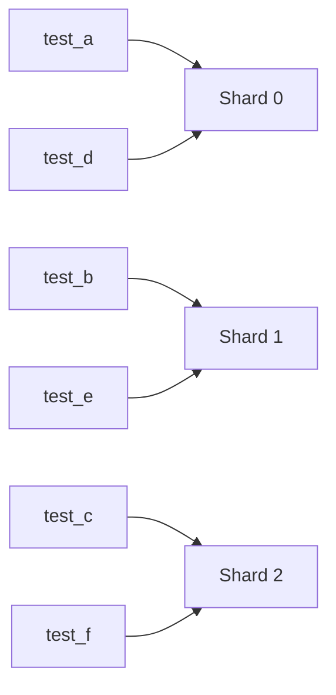
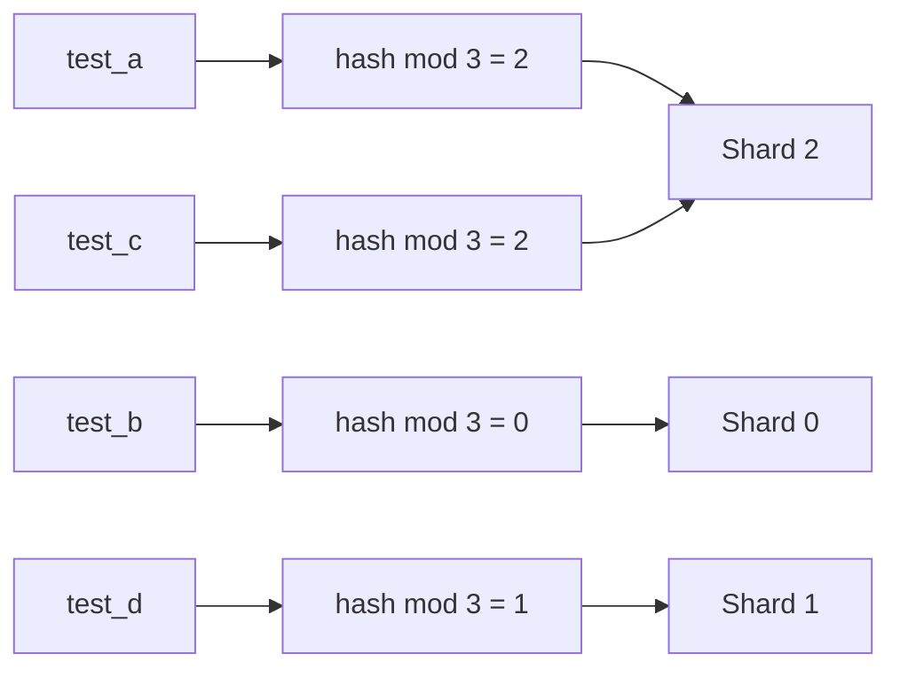
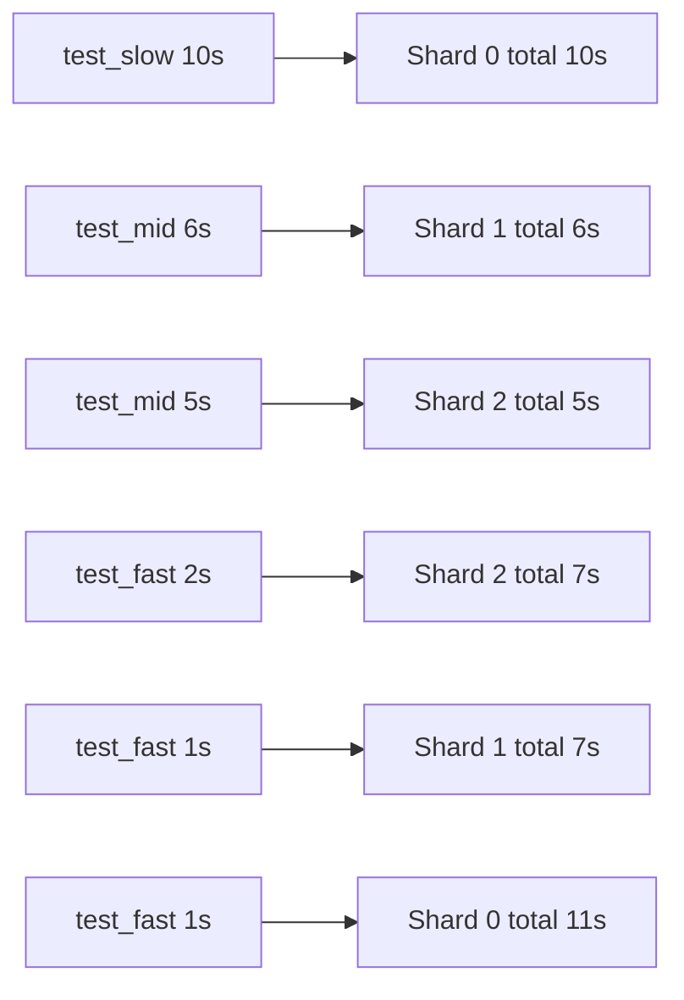

[繁體中文](sharding-modes.zh-TW.md) | **English**

# Sharding Modes

This guide explains how each `pytest-shard` mode behaves, how to generate `.test_durations`, and when to choose each strategy.

## Available modes

Three modes are available via `--shard-mode`:

### `roundrobin` (default)

Tests are sorted by node ID and distributed by index:

```
shard_id = index_in_sorted_list % num_shards
```



- Shard sizes differ by **at most 1** regardless of test count.
- Deterministic per run, but adding or removing tests shifts the assignment of other tests.

### `hash`

```
shard_id = SHA-256(test_node_id) % num_shards
```



- Each test's assignment is **stable in isolation** — adding or removing other tests never changes where an existing test lands.
- Stateless, no extra files needed.
- Distribution may be uneven for small test counts.

### `duration`

Uses a `.test_durations` JSON file (compatible with [pytest-split](https://github.com/jerry-git/pytest-split)) mapping node IDs to seconds:

```json
{
  "tests/test_foo.py::test_slow": 4.2,
  "tests/test_foo.py::test_fast": 0.1
}
```

Tests are assigned using the **Longest Processing Time (LPT)** greedy algorithm: sort by duration descending, then place each test into the shard with the smallest accumulated time. Tests with no recorded duration default to 1.0 s.



## Recording `.test_durations`

Use `--store-durations` to record each test's call-phase duration and write it at session end:

```bash
# Write to .test_durations in the current directory
pytest tests --store-durations

# Write to a custom path
pytest tests --store-durations --durations-path=artifacts/test_durations.json
```

- `--store-durations` enables duration recording for the current run.
- `--durations-path=PATH` controls where the JSON file is written or read from. The default is `.test_durations`.
- Existing entries in the file are preserved; tests executed in the current run overwrite only their own entries.
- When running shards in parallel, each shard should write to its own file, then you merge them before using `--shard-mode=duration`.

## Verbose shard report

By default, pytest prints a one-line summary at collection time:

```
Running 7 items in this shard (mode: roundrobin)
```

Pass `-v` to also list every test node ID assigned to this shard:

```
Running 7 items in this shard (mode: roundrobin): tests/test_foo.py::test_a, ...
```

## Duration mode prerequisite

`--shard-mode=duration` requires the file pointed to by `--durations-path` to already exist.
If the file is missing, run a normal test pass with `--store-durations` first, for example:

```bash
pytest tests --store-durations --durations-path=.test_durations
pytest tests --shard-mode=duration --durations-path=.test_durations --num-shards=3 --shard-id=0
```

## Mode comparison

| Mode | Count balance | Time balance | Needs data file | Per-test stable |
|------|:---:|:---:|:---:|:---:|
| `roundrobin` | ✓ (exact) | — | — | — |
| `hash` | △ (small N) | — | — | ✓ |
| `duration` | — | ✓ (optimal) | ✓ | — |

## Which mode should you choose?

- Choose `roundrobin` when you want the safest default and roughly equal test counts across shards.
- Choose `hash` when per-test assignment stability matters more than perfectly even shard sizes, for example when you want a given test to stay on the same shard as the suite changes.
- Choose `duration` when test runtimes vary a lot and total wall-clock time matters more than equal test counts. This is usually the best option for mature CI pipelines once you have a valid `.test_durations` file.
